# 💰 Personal Expense Management System


---

## 📌 Overview
This is a web-based Personal Expense Management System developed to help users manage their financial activities in a structured and efficient way. The application allows users to record, track, and analyze their income and expenses while maintaining a clear overview of their financial health.


> ⚠️ This project is developed for educational purposes only.

---

## 🚀 Features

- 🔐 Secure User Authentication (Login & Signup with hashed passwords and session management)
- 📋 Dynamic Forms based on Occupation (Student, Employed, Self-employed, etc.)
- 💸 Income & Expense Tracking
- 📊 Interactive Dashboard with:
  - Expense distribution visualization  
  - Income vs Expense comparison  
- 🎯 Savings Goal Tracking with Progress Indicator
- 📅 Monthly Financial Reports & Expense History
- ✏️ Edit & Update Financial Data
- 👤 Profile Management
- 🔑 Password Change Functionality
- ✅ Input Validation for accurate data entry

---

## 🛠️ Tech Stack

- **Frontend:** HTML, CSS, JavaScript  
- **Backend:** PHP  
- **Database:** PostgreSQL  
- **Server:** XAMPP  

---

## 🔒 Security Features

- Passwords are securely hashed before storing in the database  
- Session management is used to maintain user login state  
- Input validation is implemented for safer data handling  

---

## 🗄️ Database Structure

The system uses multiple relational tables:

- Users  
- Occupation Details  
- Income  
- Expenses  
- Goals  
- Monthly History  
- Monthly Breakdown  

---

## 🔄 System Workflow

1. User registers and logs into the system  
2. User enters personal and financial details  
3. Data is processed by the backend (PHP)  
4. Data is stored in PostgreSQL database  
5. Dashboard displays analytics and reports  
6. Monthly data is archived into history tables  

---

## 📊 Key Highlights

- Real-time financial calculations  
- Visual representation of financial data  
- Goal-based savings tracking  
- Automated monthly reporting system  

---

## 📸 Screenshots

### 🔐 Authentication

#### Login Page
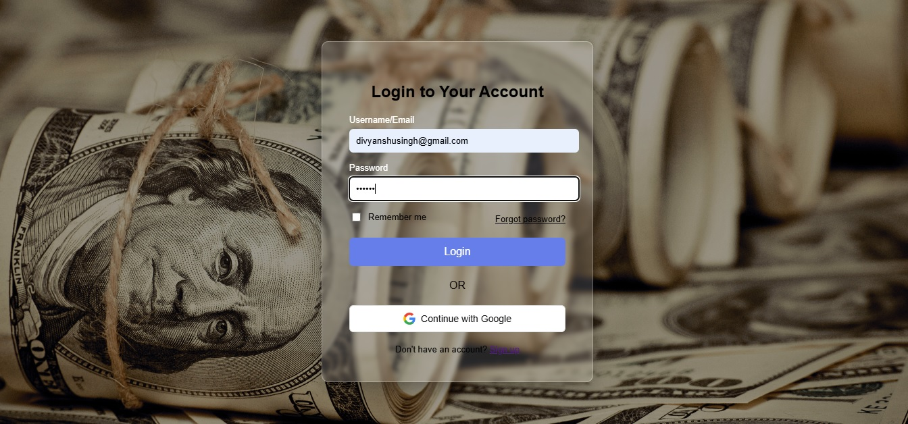

#### Sign Up Page


#### Reset Password
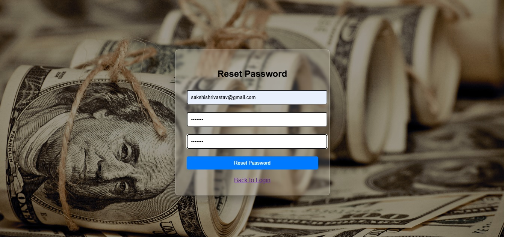

---

### 🧾 User Input & Forms

#### Basic Details Form
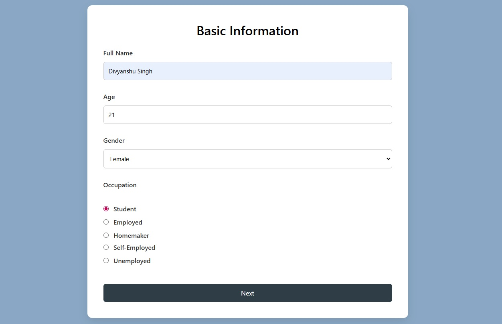

#### Personalized Forms (Based on Occupation)
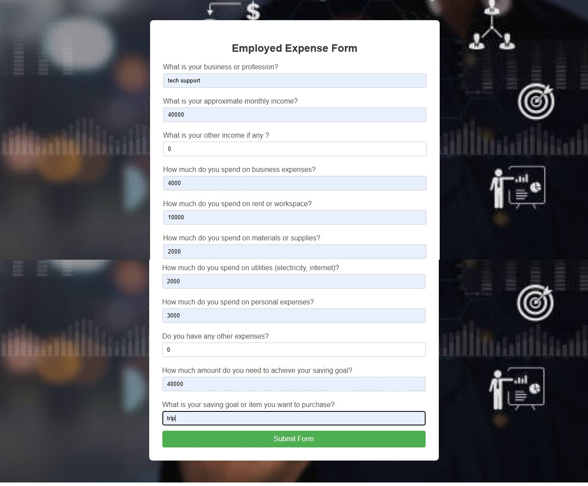
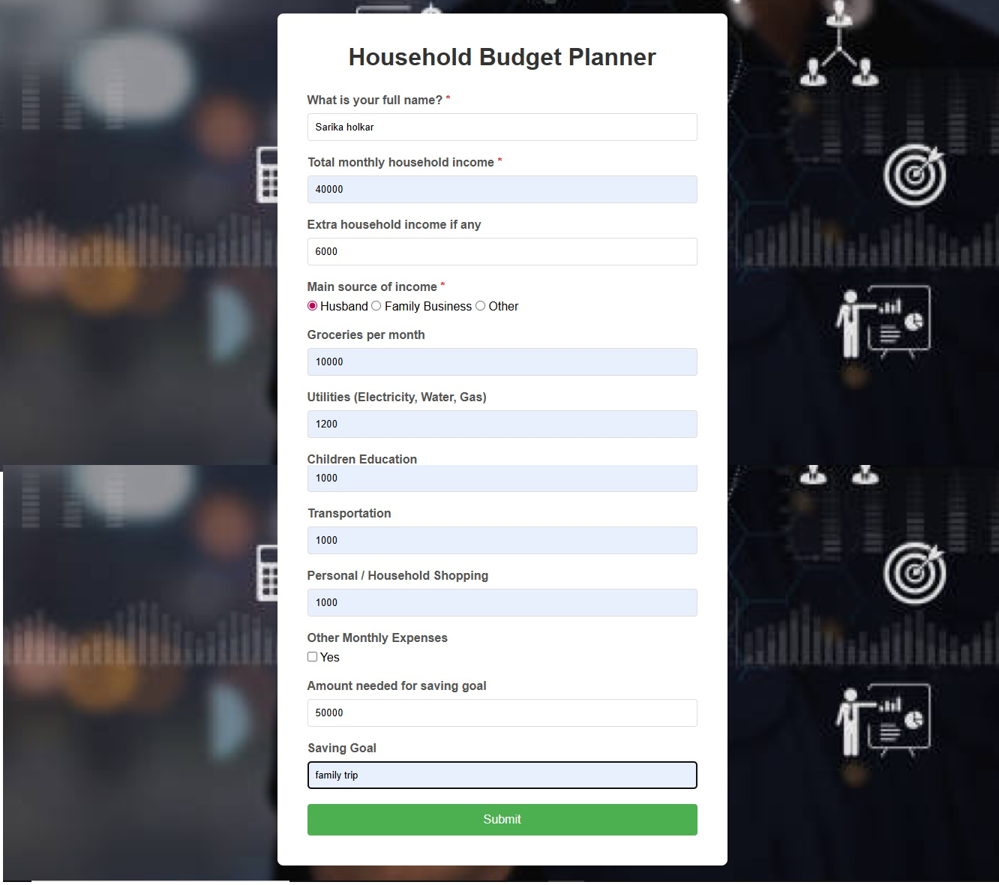
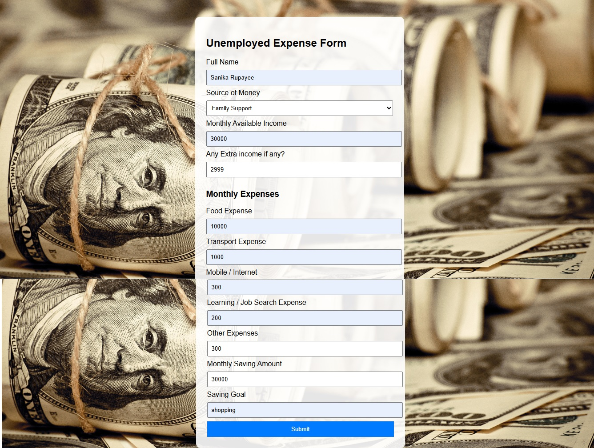
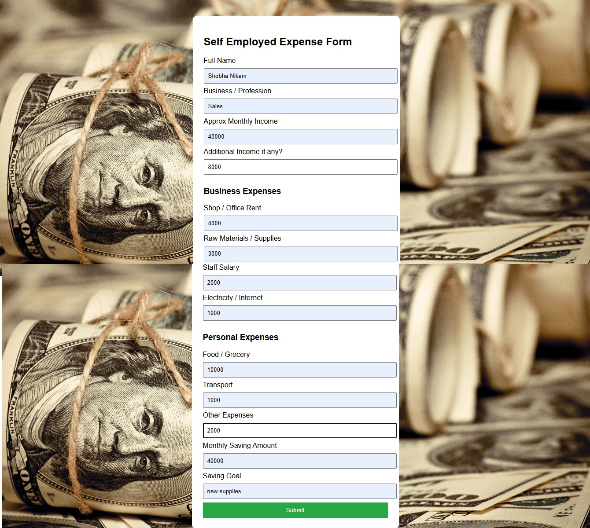
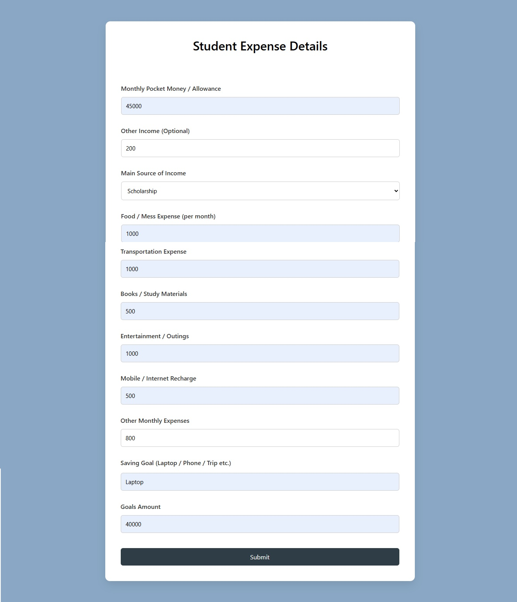

#### Validations
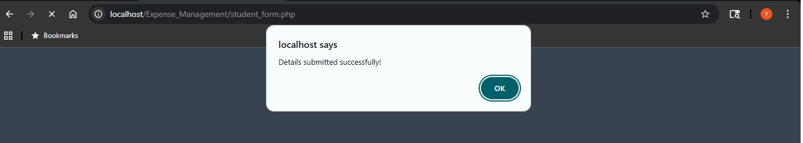
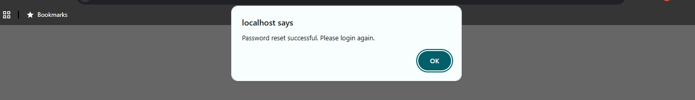

---

### 📊 Dashboard & Analytics

#### Dashboard Overview
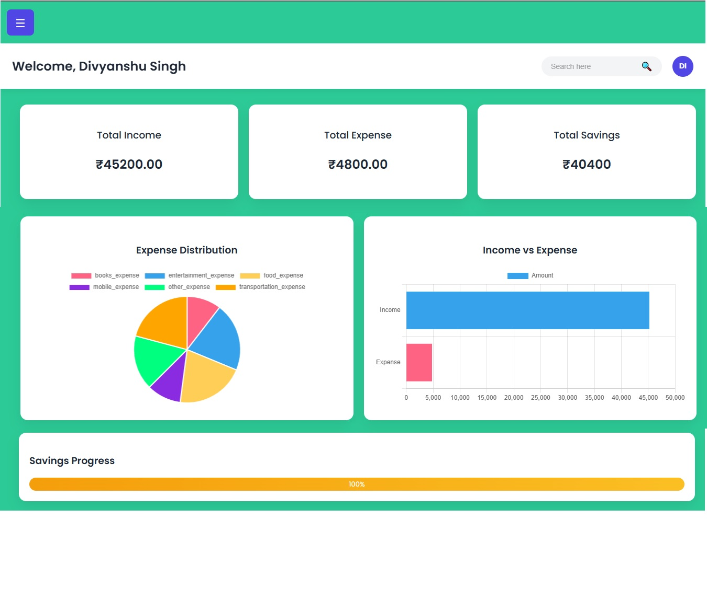

#### Dashboard with Slider
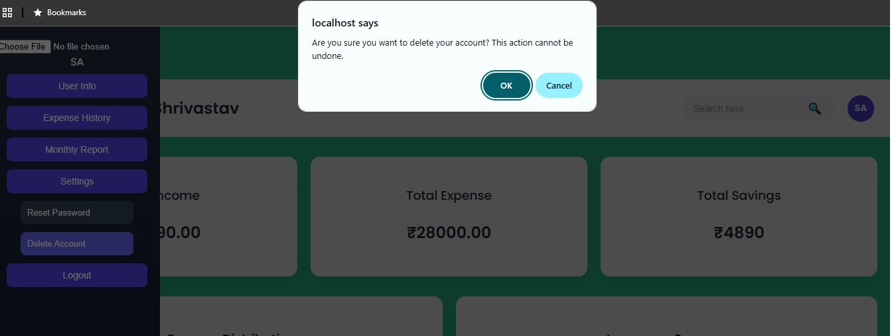

---

### 📅 Reports & History

#### Monthly Report
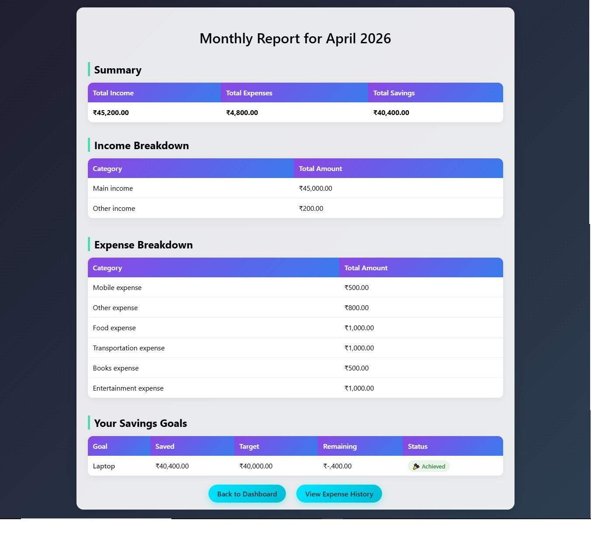

#### Expense History (Before Dropdown)


#### Expense History (After Dropdown)
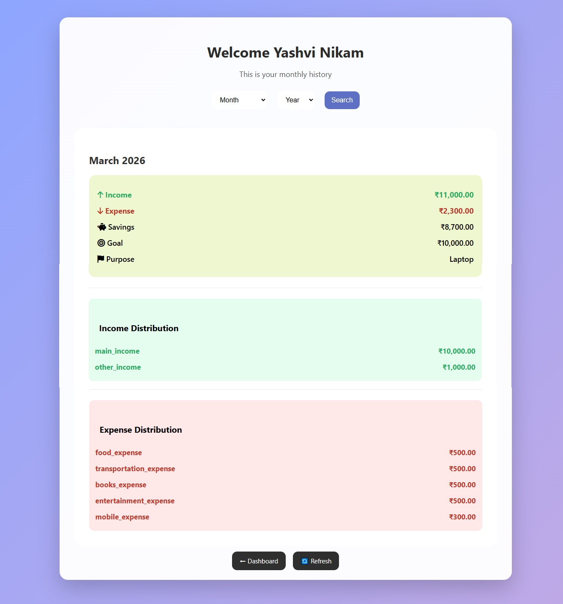

---

### 🎉 Additional Screens

#### Welcome Screen


#### Congratulations Screen


---

## ⚙️ Installation & Setup

1. Clone the repository:
```
git clone https://github.com/Yashvi-Nikam/Expense_Management.git
```

2. Move the project folder to XAMPP `htdocs`

3. Start Apache and PostgreSQL services

4. Import the database into PostgreSQL

5. Run the project in browser:
```
http://localhost/Expense_Management/index.html
```

---

## 🔮 Future Scope

- AI-based financial insights and predictions  
- Mobile application version  
- Banking API integration  
- Notification system  

---


